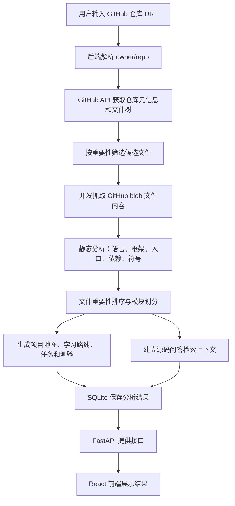

# GitLearnAgent

面向编程初学者的 GitHub 开源项目学习 Agent。

GitLearnAgent 可以输入一个公开 GitHub 仓库地址，自动抓取仓库结构与关键源码，进行静态分析、模块划分、核心文件排序，并生成适合初学者阅读的项目地图、学习路线、源码问答和 Markdown 报告。

它不是简单地把 GitHub 链接丢给大模型做摘要，而是先用确定性的工程分析建立可靠上下文，再按教学逻辑组织输出。

## 目录

- [项目定位](#项目定位)
- [核心功能](#核心功能)
- [技术栈](#技术栈)
- [系统架构](#系统架构)
- [快速开始](#快速开始)
- [环境变量](#环境变量)
- [GitHub Token 说明](#github-token-说明)
- [运行方式](#运行方式)
- [API 接口](#api-接口)
- [项目结构](#项目结构)
- [工作原理](#工作原理)
- [测试](#测试)
- [上传 GitHub 注意事项](#上传-github-注意事项)
- [常见问题](#常见问题)
- [当前限制](#当前限制)
- [后续计划](#后续计划)

## 项目定位

很多编程初学者想学习开源项目，但常常会遇到这些问题：

- 不知道应该先看哪个文件。
- 看见复杂目录结构后不知道模块之间的关系。
- 只看 README 不足以理解项目实现。
- 直接问通用 AI 时，回答可能缺少源码依据。
- 大模型一次性总结仓库时容易遗漏入口文件、配置文件和真实模块边界。

GitLearnAgent 的目标是把一个 GitHub 开源仓库转化为一套适合初学者的学习材料：

- 先建立项目全局印象。
- 再理解依赖和启动方式。
- 然后顺着入口文件追踪主流程。
- 接着按模块阅读核心代码。
- 最后通过小任务验证理解。

## 核心功能

| 功能 | 说明 |
| --- | --- |
| GitHub 仓库抓取 | 输入公开仓库 URL，自动读取仓库元信息、目录树和关键文本文件。 |
| 静态分析 | 支持 Python、JavaScript、TypeScript 项目的基础结构分析。 |
| 文件重要性排序 | 根据 README、依赖文件、入口文件、源码目录、导入关系等线索计算核心文件。 |
| 项目地图 | 展示目录树、核心文件、模块职责和模块关系。 |
| 学习路线 | 生成面向初学者的分阶段阅读路径、任务和测验。 |
| 源码问答 | 根据已抓取源码进行检索式问答，并返回引用文件和代码片段。 |
| 报告导出 | 生成 Markdown 格式的项目学习报告。 |
| 可选大模型增强 | 配置 `LLM_API_KEY` 后，可使用 OpenAI 兼容模型增强部分自然语言表达。未配置时仍可运行。 |

## 技术栈

### 后端

- Python 3.12
- FastAPI
- SQLite
- GitHub REST API
- Python `ast` 静态分析
- 规则检索与本地问答兜底

### 前端

- React
- TypeScript
- Vite
- lucide-react
- 原生 CSS

### 开发环境

推荐使用 Anaconda / Miniconda，也可以使用普通 Python 虚拟环境。

## 系统架构



## 快速开始

### 1. 克隆项目

```powershell
git clone https://github.com/anon-0215/GitLearnAgent.git
cd GitLearnAgent
```

### 2. 创建环境

推荐使用 conda：

```powershell
conda env create -f environment.yml
conda activate gitlearnagent
```

如果你的 `conda` 没有配置到环境变量，可以使用 Anaconda Prompt，或者用 Anaconda 的完整路径执行。

### 3. 配置环境变量

复制模板：

```powershell
copy .env.example .env
notepad .env
```

至少建议填写：

```text
GITHUB_TOKEN=你的 GitHub Token
```

### 4. 一键启动

Windows 下可以直接运行：

```powershell
start_all.bat
```

该脚本会打开两个窗口：

- 后端窗口：`http://127.0.0.1:8000`
- 前端窗口：`http://127.0.0.1:5173`

使用项目时两个窗口都不要关闭。

### 5. 打开页面

浏览器访问：

```text
http://127.0.0.1:5173
```

输入一个公开 GitHub 仓库地址，例如：

```text
https://github.com/tiangolo/fastapi
```

## 环境变量

项目会读取根目录下的 `.env` 文件。

| 变量 | 必填 | 说明 |
| --- | --- | --- |
| `GITHUB_TOKEN` | 推荐 | GitHub Personal Access Token，用于提高 GitHub API 请求额度。 |
| `LLM_BASE_URL` | 否 | OpenAI 兼容接口地址，例如 DeepSeek、通义、智谱等服务的 base URL。 |
| `LLM_API_KEY` | 否 | 大模型 API Key。未配置时，系统使用本地规则生成学习路线和问答结果。 |
| `LLM_MODEL` | 否 | 模型名称，默认可使用 `deepseek-chat` 一类 OpenAI 兼容模型名。 |
| `EMBEDDING_ENABLED` | 否 | V2 稠密向量能力开关，默认 `false`，避免首次启动自动下载大型模型。 |
| `EMBEDDING_MODEL_NAME_OR_PATH` | 否 | Sentence Transformers 模型名或本地模型目录，默认 `BAAI/bge-m3`。 |
| `EMBEDDING_MODEL_REVISION` | 否 | Hugging Face 模型 revision 或 commit。建议生产环境填写固定 commit；本地目录模型不会扫描模型文件内容做指纹。 |
| `EMBEDDING_DEVICE` | 否 | `auto`、`cpu` 或 `cuda`。`cuda` 不可用时会明确报错。 |
| `EMBEDDING_BATCH_SIZE` | 否 | Embedding 批量编码大小，默认 `8`。 |
| `EMBEDDING_MAX_LENGTH` | 否 | 模型最大文本长度，默认 `8192`，运行时限制在 `16` 到 `8192`。 |
| `EMBEDDING_NORMALIZE` | 否 | 是否保存 L2 归一化向量，默认 `true`。 |
| `EMBEDDING_CACHE_DIR` | 否 | Sentence Transformers 模型缓存目录，默认 `embedding_cache`。 |
| `EMBEDDING_QUERY_PREFIX` | 否 | 查询文本前缀，可为空。 |
| `EMBEDDING_DOCUMENT_PREFIX` | 否 | 代码块文档文本前缀，可为空。 |
| `VITE_API_BASE_URL` | 否 | 前端请求后端的地址，默认 `http://127.0.0.1:8000`。 |

`.env.example` 示例：

```text
GITHUB_TOKEN=
LLM_BASE_URL=https://api.deepseek.com
LLM_API_KEY=
LLM_MODEL=deepseek-chat
EMBEDDING_ENABLED=false
EMBEDDING_MODEL_NAME_OR_PATH=BAAI/bge-m3
EMBEDDING_MODEL_REVISION=
EMBEDDING_DEVICE=auto
EMBEDDING_BATCH_SIZE=8
EMBEDDING_MAX_LENGTH=8192
EMBEDDING_NORMALIZE=true
EMBEDDING_CACHE_DIR=embedding_cache
EMBEDDING_QUERY_PREFIX=
EMBEDDING_DOCUMENT_PREFIX=
VITE_API_BASE_URL=http://127.0.0.1:8000
```

启用 BGE-M3 前，请先在后端 Python 环境中安装 `sentence-transformers`
和兼容的 PyTorch。系统不会在应用启动时自动加载模型；只有
`EMBEDDING_ENABLED=true` 且分析代码块保存完成后，才会尝试建立
SQLite 向量缓存。真实模型可来自 Hugging Face 名称 `BAAI/bge-m3`，
也可以来自用户配置的本地模型目录。

向量缓存命中会同时校验 code chunk、源码内容哈希、最终 embedding
输入哈希、模型名称、模型 revision、文本格式版本、prefix/max length
等配置身份和 normalized 设置。Hugging Face 模型会优先记录显式配置
的 revision，并在真实加载后尽量读取 resolved commit；如果使用本地
模型目录，当前只记录目录路径标识，不会为了启动速度去哈希数 GB 的
模型文件。

## GitHub Token 说明

GitHub Token 不是大模型 API，也不是付费接口。它相当于访问 GitHub API 时使用的身份凭证。

不使用 token 时，GitHub 会把你的请求当作匿名请求，额度较低，容易出现：

```text
API rate limit exceeded
```

配置 `GITHUB_TOKEN` 后，请求额度会提高，适合反复分析仓库。

注意：

- 不要把 `.env` 上传到 GitHub。
- 不要把 token 发给别人。
- token 必须逐字复制，不能缺字符，不能把下划线 `_` 改成空格。
- 如果看到 `Bad credentials`，说明 token 无效、过期、复制错误或被撤销。

可以访问后端健康检查确认 token 是否被读取：

```text
http://127.0.0.1:8000/api/health
```

返回示例：

```json
{
  "ok": true,
  "llm_available": false,
  "github_token_configured": true,
  "database": "D:\\Project\\GitLearnAgent\\backend\\data\\gitlearn.sqlite"
}
```

## 运行方式

### 一键启动

```powershell
start_all.bat
```

### 分别启动后端和前端

后端：

```powershell
backend\run_backend.bat
```

前端：

```powershell
frontend\run_frontend.bat
```

### 手动启动后端

```powershell
cd backend
python -m uvicorn app.main:app --reload --host 127.0.0.1 --port 8000
```

### 手动启动前端

```powershell
cd frontend
npm install
npm run dev
```

## API 接口

后端默认运行在：

```text
http://127.0.0.1:8000
```

| 方法 | 路径 | 说明 |
| --- | --- | --- |
| `GET` | `/api/health` | 健康检查，确认后端、LLM 配置和 GitHub token 状态。 |
| `POST` | `/api/projects/analyze` | 提交 GitHub 仓库 URL，开始分析并返回 `project_id`。 |
| `GET` | `/api/projects/{project_id}` | 获取项目概览、技术栈、核心文件和模块摘要。 |
| `GET` | `/api/projects/{project_id}/map` | 获取目录树、模块关系和核心文件列表。 |
| `GET` | `/api/projects/{project_id}/learning-path` | 获取学习路线、任务和测验。 |
| `POST` | `/api/projects/{project_id}/ask` | 对已分析项目进行源码问答，返回答案和引用片段。 |
| `GET` | `/api/projects/{project_id}/report` | 获取 Markdown 格式分析报告。 |

分析请求示例：

```http
POST /api/projects/analyze
Content-Type: application/json

{
  "repo_url": "https://github.com/tiangolo/fastapi"
}
```

问答请求示例：

```http
POST /api/projects/{project_id}/ask
Content-Type: application/json

{
  "question": "项目入口文件在哪里？"
}
```

## 项目结构

```text
GitLearnAgent/
  backend/
    app/
      main.py                 FastAPI 入口与 API 路由
      config.py               .env 配置读取
      database.py             SQLite 存储层
      models.py               仓库文件与快照模型
      services/
        github_client.py      GitHub API 抓取与文件筛选
        analyzer.py           静态分析与模块划分
        ranker.py             文件重要性评分
        learning_agent.py     学习路线生成
        qa_agent.py           源码问答
        llm_client.py         OpenAI 兼容模型客户端
        report.py             Markdown 报告生成
    tests/                    后端单元测试
    requirements.txt          后端依赖
    run_backend.bat           Windows 后端启动脚本

  frontend/
    src/
      App.tsx                 前端主界面
      lib/api.ts              后端 API 调用封装
      types.ts                前端类型定义
      styles.css              页面样式
    package.json              前端依赖与脚本
    run_frontend.bat          Windows 前端启动脚本

  docs/
    project_proposal.md       大创项目申报简稿
    technical_route.md        技术路线说明
    experiment_plan.md        对比实验设计

  samples/
    demo_repositories.md      推荐演示仓库

  .env.example                环境变量模板
  .gitignore                  Git 忽略规则
  environment.yml             conda 环境定义
  start_all.bat               Windows 一键启动脚本
```

## 工作原理

### 1. 仓库抓取

后端会解析 GitHub URL，提取 `owner/repo`，然后通过 GitHub REST API 获取：

- 仓库元信息
- 默认分支
- 递归文件树
- 候选文件 blob 内容

为了避免大仓库等待过久，系统会先对文件路径做优先级排序：

- 优先抓取 README。
- 优先抓取依赖和配置文件。
- 优先抓取入口文件。
- 优先抓取 `src`、`app`、`backend`、`frontend`、`tests` 等目录。
- 跳过 `node_modules`、`dist`、`build`、`.venv`、二进制文件和大文件。
- 普通 Markdown 文档不会大量抓取，只保留 README 等关键说明文件。

当前版本会并发抓取关键候选文件，以降低大仓库分析时间。

### 2. 静态分析

系统目前支持基础分析：

- Python：使用 `ast` 提取 import、函数、类。
- JavaScript / TypeScript：提取 import/export、函数、类和前端入口线索。
- 配置文件：识别 `package.json`、`pyproject.toml`、`requirements.txt` 等。
- 框架识别：根据依赖和源码线索识别 React、Vite、FastAPI、Flask、Django 等。

### 3. 文件重要性评分

系统会根据以下线索给文件打分：

- 是否是 README。
- 是否是依赖或配置文件。
- 是否是入口文件。
- 是否位于源码目录。
- 是否包含框架入口特征。
- import 数量。
- 函数、类、组件等符号数量。

得分靠前的文件会被标记为核心文件。

### 4. 模块划分

系统主要根据目录结构和文件职责聚合模块。例如：

- `docs`
- `project-config`
- `backend`
- `frontend`
- `src`
- `tests`

每个模块会生成职责说明和推荐阅读文件。

### 5. 学习路线生成

当前学习路线按五个阶段生成：

1. 建立项目全局印象。
2. 理解依赖和启动方式。
3. 顺着入口文件追主流程。
4. 分模块阅读核心代码。
5. 完成一个小修改任务。

即使没有配置大模型 API，这部分也可以通过本地规则生成。

### 6. 源码问答

问答流程不是直接让模型猜答案，而是：

```text
用户问题
→ 本地检索相关文件
→ 提取相关代码片段
→ 生成带引用路径的回答
```

如果配置了 `LLM_API_KEY`，系统会用大模型增强表达；如果没有配置，则使用本地规则回答。

### 7. 报告生成

报告接口会输出 Markdown，包含：

- 项目基础信息
- 技术栈
- 项目概览
- 核心文件
- 模块地图
- 推荐学习路线
- 大创差异化说明

## 测试

后端测试：

```powershell
cd backend
python -B -m unittest discover tests
```

前端类型检查：

```powershell
cd frontend
node node_modules/typescript/bin/tsc
```

前端生产构建：

```powershell
cd frontend
npm run build
```

## 上传 GitHub 注意事项

不要上传这些文件或目录：

```text
.env
backend/.venv/
frontend/node_modules/
frontend/dist/
backend/data/
frontend/.vite-cache/
__pycache__/
```

这些已经写入 `.gitignore`。

可以上传：

```text
.env.example
environment.yml
backend/requirements.txt
frontend/package.json
frontend/package-lock.json
README.md
docs/
samples/
```

`.env.example` 是模板，可以上传；`.env` 是本地密钥配置，不能上传。

## 常见问题

### 1. PowerShell 提示 `conda` 不是命令

说明 Anaconda 没有加入环境变量。解决方式：

- 使用 Anaconda Prompt。
- 或直接运行项目提供的 `.bat` 脚本。
- 或把 Anaconda 添加到 PATH。

### 2. PowerShell 禁止运行 `.ps1`

Windows 默认可能禁止执行 PowerShell 脚本。可以直接运行：

```powershell
backend\run_backend.bat
frontend\run_frontend.bat
```

### 3. 前端显示 `Failed to fetch`

通常是后端没有启动。

请确认：

```text
http://127.0.0.1:8000/api/health
```

可以正常打开。

### 4. GitHub 显示 `API rate limit exceeded`

说明匿名请求额度用完了。

请在 `.env` 中配置：

```text
GITHUB_TOKEN=你的 GitHub Token
```

然后重启后端。

### 5. GitHub 显示 `Bad credentials`

说明 token 无效。常见原因：

- token 复制不完整。
- token 已过期。
- token 被删除或撤销。
- token 中的下划线被改成空格。
- `.env` 中多了引号、空格或注释。

正确写法：

```text
GITHUB_TOKEN=github_pat_xxxxxxxxxxxxxxxxx
```

### 6. 分析大仓库一直等待

大仓库会比小仓库慢。当前版本已经做了核心文件筛选和并发抓取。

一般仓库建议等待 20-60 秒。如果超过 2 分钟，可以：

- 刷新前端页面。
- 重启后端。
- 先用较小仓库测试。

推荐演示仓库见：

```text
samples/demo_repositories.md
```

### 7. 没有配置大模型 API 能运行吗？

可以。

当前项目的核心能力来自 GitHub 抓取、静态分析、文件排序、模块划分和本地规则。大模型 API 是可选增强项，不是必需项。

## 当前限制

- 只支持公开 GitHub 仓库。
- 首版重点支持 Python、JavaScript、TypeScript。
- JS/TS 分析目前是轻量规则，不是完整 TypeScript 编译器级分析。
- Python 支持基础 AST 分析，但暂不构建完整跨文件调用图。
- 问答检索目前是本地关键词和规则评分，不是完整向量数据库。
- 大模型增强只支持 OpenAI 兼容接口。
- 暂不支持私有仓库 OAuth 授权。
- 暂不执行被分析仓库代码，避免安全风险。

## 后续计划

- 支持更多语言，例如 Java、Go、Rust。
- 引入 Tree-sitter 或 Language Server Protocol，提高结构分析能力。
- 加入向量检索，提高源码问答召回率。
- 增加后台任务队列和进度条，改善大仓库体验。
- 支持上传 ZIP 仓库，减少 GitHub 网络依赖。
- 增加用户学习进度记录。
- 增加更系统的对比实验评测模块。
- 生成适合大创答辩的可视化分析报告。

## 项目价值

GitLearnAgent 的重点不是替代通用 AI，而是探索一种更适合编程初学者的开源项目导读方式。

相比直接问通用 AI，本项目强调：

- 先分析代码结构，再生成解释。
- 回答必须附带源码引用。
- 输出学习路径而不是一次性摘要。
- 可以用模块覆盖率、引用准确率、幻觉率、学习友好度等指标做评测。

这使它更适合作为“大创”项目进行展示、实验和后续扩展。

## License

当前仓库尚未选择开源许可证。正式公开推广前，建议补充 `LICENSE` 文件，例如 MIT License。

